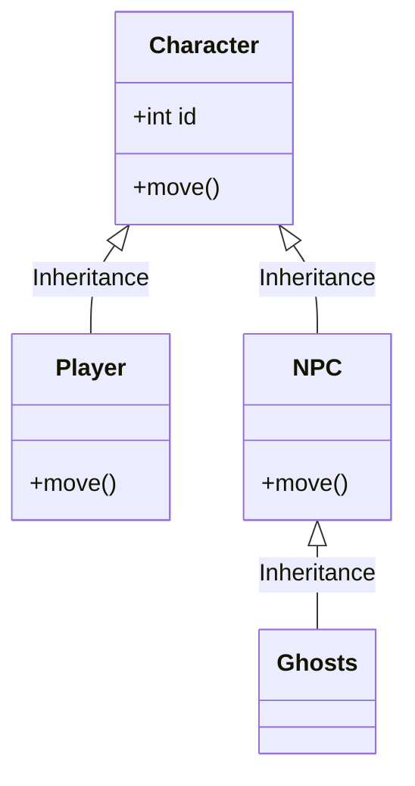

<!-- ↓               Título do repositório                ↓ -->
<h1 align="center">

[]()
PycMan
[]()

</h1>
<!-- ↑                        Fim                         ↑ -->

<!-- ↓              Descrição do repositório              ↓ -->
### :memo: Descrição
Clone do jogo PacMan: Escrito em Python
<!-- ↑                        Fim                         ↑ -->

<!-- ↓      Tecnologias utilizadas na implementação       ↓ -->
### :wrench: Tecnologias utilizadas
* Python
* PyGame
<!-- ↑                        Fim                         ↑ -->

<!-- ↓      Funcionalidades implementadas na solução      ↓ -->
### :gear: Funcionalidades
* <b>Funcionalidade</b>: O que essa funcionalidade faz?
<!-- ↑                        Fim                         ↑ -->

<!-- ↓           Estrutura de pastas do projeto           ↓ -->
### :clipboard: Estrutura do projeto
A estrutura do projeto contém essas pastas, que são:<br />
<br />
:books: 'libraries': pasta que contém as bibliotecas e dependências do projeto<br />
:gear: 'resources': pasta que contém os recursos, como os sons, as imagens, as fontes, entre outros<br />
:page_facing_up: 'classes': pasta que contém os códigos de implementação do projeto<br />
:package: 'export': pasta que contém o arquivo compilado e pronto para execução<br />
<details>
    <summary>:open_file_folder: PycMan/</summary>
    <details open>
        <summary>:open_file_folder: classes/</summary>
        :page_facing_up: game.py
    </details>
    <details open>
        <summary>:open_file_folder: resources/</summary>
        <details open>
            <summary>:open_file_folder: audios/</summary>
            :page_facing_up: credit.wav<br />
            :page_facing_up: death_1.wav<br />
            :page_facing_up: death_2.wav<br />
            :page_facing_up: eat_fruit.wav<br />
            :page_facing_up: eat_ghost.wav<br />
            :page_facing_up: extend.wav<br />
            :page_facing_up: game_start.wav<br />
            :page_facing_up: intermission.wav<br />
            :page_facing_up: munch_1.wav<br />
            :page_facing_up: munch_2.wav<br />
            :page_facing_up: power_pellet.wav<br />
            :page_facing_up: retreating.wav<br />
            :page_facing_up: siren_1.wav<br />
            :page_facing_up: siren_2.wav<br />
            :page_facing_up: siren_3.wav<br />
            :page_facing_up: siren_4.wav<br />
            :page_facing_up: siren_5.wav
        </details>
        <details open>
            <summary>:open_file_folder: fonts/</summary>
            :page_facing_up: FreeSansBold.ttf<br />
            :page_facing_up: RetroGaming.ttf
        </details>
        <details open>
            <summary>:open_file_folder: images/</summary>
            :page_facing_up: ghost.png<br />
            :page_facing_up: icon.png<br />
            :page_facing_up: logo.png
        </details>
    </details>
    :page_facing_up: .gitignore<br />
    :page_facing_up: LICENSE<br />
    :page_facing_up: README.md<br />
    :page_facing_up: constantes.py<br />
    :page_facing_up: principal.py<br />
    :page_facing_up: run.py
</details>
<!-- ↑                        Fim                         ↑ -->

<!-- ↓                Diagrama de classes                 ↓ -->
### :label: Diagrama

<!-- ↑                        Fim                         ↑ -->

<!-- ↓  ↓ -->
### :electric_plug: Pre-requisitos
```bash
```
<!-- ↑                        Fim                         ↑ -->

<!-- ↓  ↓ -->
### :rocket: Rodando o projeto
Para rodar o repositório é necessário clonar o mesmo, dar o seguinte comando para iniciar o projeto:
```bash
```
<!-- ↑                        Fim                         ↑ -->

<!-- ↓  ↓ -->
### :inbox_tray: Download
<!-- ↑                        Fim                         ↑ -->

<!-- ↓  ↓ -->
### :space_invader: Executando o jogo
Para jogar é necessário:
```bash
```
<!-- ↑                        Fim                         ↑ -->

<!-- ↓  ↓ -->
### :dart: Status do projeto
<!-- ↑                        Fim                         ↑ -->

<!-- ↓  ↓ -->
### :hourglass: Implementação futura
* O que será implementado na próxima sprint?
<!-- ↑                        Fim                         ↑ -->

<!-- ↓  ↓ -->
### :handshake: Colaboradores
| <br />[calbertofilho](https://github.com/calbertofilho) | <br />[victortarg](https://github.com/victortarg) |
| :-: | :-: |
<!-- ↑                        Fim                         ↑ -->