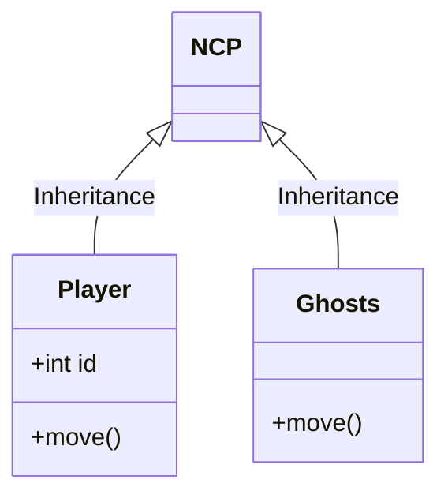

<!-- ↓               Título do repositório                ↓ -->
<h1 align="center">

[]()
PycMan
[]()

</h1>
<!-- ↑                        Fim                         ↑ -->

<!-- ↓              Descrição do repositório              ↓ -->
### :memo: Descrição
Clone do jogo PacMan: Escrito em Python
<!-- ↑                        Fim                         ↑ -->

<!-- ↓      Tecnologias utilizadas na implementação       ↓ -->
### :wrench: Tecnologias utilizadas
* Python
* PyGame
<!-- ↑                        Fim                         ↑ -->

<!-- ↓      Funcionalidades implementadas na solução      ↓ -->
### :gear: Funcionalidades
* <b>Funcionalidade</b>: O que essa funcionalidade faz?
<!-- ↑                        Fim                         ↑ -->

<!-- ↓                Diagrama de classes                 ↓ -->
### :label: Diagrama

<!-- ↑                        Fim                         ↑ -->

<!-- ↓  ↓ -->
### :electric_plug: Pre-requisitos
```bash
```
<!-- ↑                        Fim                         ↑ -->

<!-- ↓  ↓ -->
### :rocket: Rodando o projeto
Para rodar o repositório é necessário clonar o mesmo, dar o seguinte comando para iniciar o projeto:
```bash
```
<!-- ↑                        Fim                         ↑ -->

<!-- ↓  ↓ -->
### :inbox_tray: Download
<!-- ↑                        Fim                         ↑ -->

<!-- ↓  ↓ -->
### :space_invader: Executando o jogo
Para jogar é necessário:
```bash
```
<!-- ↑                        Fim                         ↑ -->

<!-- ↓  ↓ -->
### :dart: Status do projeto
<!-- ↑                        Fim                         ↑ -->

<!-- ↓  ↓ -->
### :hourglass: Implementação futura
* O que será implementado na próxima sprint?
<!-- ↑                        Fim                         ↑ -->

<!-- ↓  ↓ -->
### :handshake: Colaboradores
| <br />[calbertofilho](https://github.com/calbertofilho) | <br />[victortarg](https://github.com/victortarg) |
| :-: | :-: |
<!-- ↑                        Fim                         ↑ -->